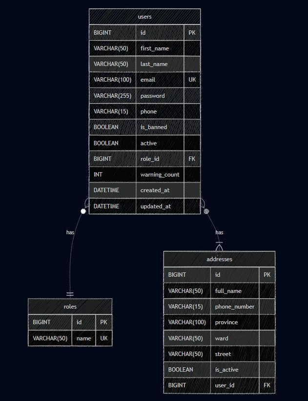

# LỜI CẢM ƠN {-}

Nhóm chúng em xin gửi lời cảm ơn chân thành nhất đến **Học viện Công nghệ Bưu chính Viễn thông — Cơ sở Thành phố Hồ Chí Minh** đã tạo điều kiện thuận lợi cho chúng em trong quá trình học tập và nghiên cứu.

Chúng em xin đặc biệt cảm ơn **Giảng viên hướng dẫn** đã tận tình chỉ bảo, hướng dẫn và đồng hành cùng nhóm trong suốt quá trình thực hiện đồ án. Những góp ý, nhận xét của thầy là động lực lớn giúp nhóm hoàn thiện sản phẩm.

Ngoài ra, nhóm cũng xin cảm ơn các bạn trong lớp đã hỗ trợ, chia sẻ kiến thức và cùng nhau thảo luận trong quá trình học tập.

Cuối cùng, nhóm xin cảm ơn gia đình và bạn bè đã luôn ủng hộ tinh thần trong suốt thời gian thực hiện đồ án này.

Thành phố Hồ Chí Minh, tháng 5 năm 2026

**Nhóm thực hiện**

\newpage

# TÓM TẮT {-}

Báo cáo này trình bày quá trình thiết kế và hiện thực hóa hệ thống thương mại điện tử **SmartVN** ứng dụng kiến trúc **Microservices** với nền tảng **Spring Boot 3.3** và **Spring Cloud**. Hệ thống được xây dựng nhằm giải quyết bài toán quản lý cửa hàng trực tuyến với yêu cầu cao về khả năng mở rộng, hiệu năng và tính sẵn sàng.

Kiến trúc Microservices cho phép hệ thống được chia thành nhiều dịch vụ nhỏ, độc lập bao gồm: **User Service** (quản lý người dùng, xác thực JWT/OAuth2), **Product Service** (quản lý sản phẩm với bộ nhớ đệm Redis), **Order Service** (quản lý đơn hàng và thanh toán VNPay), và **Admin Service** (quản trị hệ thống). Các dịch vụ giao tiếp với nhau thông qua **OpenFeign** với cơ chế **Circuit Breaker** của Resilience4j đảm bảo tính bền vững.

Hệ thống sử dụng **MySQL 8.0** làm cơ sở dữ liệu chính, **Redis 7** làm tầng cache nhằm giảm thời gian truy xuất cho các truy vấn phổ biến. **API Gateway** đóng vai trò là điểm vào duy nhất, xử lý định tuyến, xác thực JWT và quản lý CORS.

Kết quả kiểm thử hiệu năng với **Grafana k6** cho thấy hệ thống đạt hiệu suất ấn tượng: thời gian phản hồi trung bình giảm từ **47.81ms** xuống **8.66ms** (gấp **5.5 lần**) khi sử dụng Redis cache, throughput tăng **26%** từ 196.8 lên 248.5 requests/giây, và tỷ lệ lỗi giảm xuống **0%**.

Hệ thống được đóng gói hoàn toàn bằng **Docker Compose** với cơ chế health check và dependency ordering, đảm bảo khởi động ổn định và dễ dàng triển khai trên nhiều môi trường.

**Từ khóa:** Microservices, Spring Boot, Spring Cloud, Redis, JWT, OAuth2, Docker, VNPay, API Gateway, Eureka, Circuit Breaker.

\newpage

# TỔNG QUAN ĐỀ TÀI

## Giới thiệu bài toán và bối cảnh

Trong thời đại số hóa ngày nay, thương mại điện tử (e-commerce) đã trở thành một phần không thể thiếu trong cuộc sống. Theo báo cáo của Statista, doanh thu thương mại điện tử toàn cầu năm 2025 đạt hơn 6.000 tỷ USD và dự kiến sẽ tiếp tục tăng trưởng mạnh trong những năm tới. Tại Việt Nam, thị trường thương mại điện tử cũng đang phát triển nhanh chóng với sự tham gia của nhiều nền tảng lớn như Shopee, Lazada, Tiki, và Sendo.

Sự phát triển mạnh mẽ này đặt ra nhiều thách thức cho các nhà phát triển trong việc xây dựng hệ thống thương mại điện tử có khả năng:

- **Mở rộng linh hoạt:** Hệ thống cần xử lý lượng lớn người dùng đồng thời, đặc biệt vào các dịp khuyến mãi lớn.
- **Đảm bảo tính sẵn sàng:** Một dịch vụ bị lỗi không nên làm ảnh hưởng đến toàn bộ hệ thống.
- **Bảo mật cao:** Bảo vệ thông tin người dùng, giao dịch thanh toán là ưu tiên hàng đầu.
- **Duy trì và phát triển:** Hệ thống cần dễ dàng bảo trì, cập nhật từng phần mà không ảnh hưởng đến toàn bộ.

Kiến trúc **Monolithic** truyền thống, mặc dù đơn giản trong giai đoạn phát triển ban đầu, nhưng bộc lộ nhiều hạn chế khi hệ thống phát triển lớn hơn: khó mở rộng theo chiều ngang, khó deploy từng phần, và một lỗi nhỏ có thể làm sập toàn bộ hệ thống.

Để giải quyết những vấn đề trên, nhóm lựa chọn kiến trúc **Microservices** — một phương pháp thiết kế hệ thống trong đó ứng dụng được chia thành nhiều dịch vụ nhỏ, chạy độc lập và giao tiếp với nhau thông qua API. Kết hợp với hệ sinh thái **Spring Cloud**, bài toán xây dựng hệ thống thương mại điện tử trở nên khả thi và hiệu quả hơn.

## Mục tiêu đề tài

Đồ án hướng đến đạt được các mục tiêu sau:

- Thiết kế và hiện thực hóa hệ thống thương mại điện tử **SmartVN** với kiến trúc Microservices sử dụng Spring Boot và Spring Cloud.
- Triển khai đầy đủ các dịch vụ: quản lý người dùng, quản lý sản phẩm, quản lý đơn hàng, thanh toán trực tuyến, và quản trị hệ thống.
- Áp dụng cơ chế **cache Redis** nhằm cải thiện hiệu năng truy xuất dữ liệu.
- Tích hợp **xác thực đa tầng** với JWT và OAuth2 (Google, GitHub).
- Triển khai hệ thống thanh toán trực tuyến thông qua cổng **VNPay**.
- Đảm bảo tính bền vững với **Circuit Breaker** và **Fallback** sử dụng Resilience4j.
- Đóng gói và triển khai hệ thống bằng **Docker Compose** với cơ chế health check.
- Kiểm thử và đánh giá hiệu năng hệ thống thông qua công cụ **Grafana k6**.

## Phạm vi đề tài

Phạm vi thực hiện của đồ án bao gồm:

**Phía Backend (tập trung chính):**

- Xây dựng 7 microservices: Eureka Server, Config Server, API Gateway, User Service, Product Service, Order Service, Admin Service.
- Thiết kế và triển khai cơ sở dữ liệu MySQL với đầy đủ schema.
- Triển khai hệ thống cache Redis cho Product Service.
- Tích hợp xác thực JWT và OAuth2.
- Tích hợp thanh toán VNPay.
- Triển khai Circuit Breaker cho giao tiếp liên dịch vụ.

**Phía Frontend (hỗ trợ demo):**

- Customer Frontend: Giao diện người dùng với React.
- Admin Frontend: Giao diện quản trị với React.

**Ngoài phạm vi:**

- Triển khai trên môi trường production thực tế.
- Tích hợp CI/CD pipeline.
- Tối ưu SEO và hiệu năng frontend.

## Phương pháp thực hiện

Nhóm thực hiện đồ án theo các bước sau:

- **Bước 1 — Nghiên cứu và phân tích:** Tìm hiểu các công nghệ liên quan (Spring Boot, Spring Cloud, Redis, Docker), phân tích yêu cầu hệ thống.
- **Bước 2 — Thiết kế:** Thiết kế kiến trúc tổng thể, cơ sở dữ liệu, API, và luồng dữ liệu.
- **Bước 3 — Hiện thực hóa:** Lập trình từng microservice theo mô hình từ dưới lên (bottom-up), bắt đầu từ infrastructure services đến business services.
- **Bước 4 — Tích hợp:** Kết nối các dịch vụ, kiểm thử giao tiếp liên dịch vụ.
- **Bước 5 — Kiểm thử và đánh giá:** Thực hiện kiểm thử chức năng và kiểm thử hiệu năng với k6.
- **Bước 6 — Hoàn thiện báo cáo:** Tổng hợp kết quả, viết báo cáo và chuẩn bị bảo vệ.

Công cụ quản lý mã nguồn sử dụng **Git** với mô hình branching strategy. Quá trình phát triển được hỗ trợ bởi **VS Code** và **IntelliJ IDEA**.

\newpage

# CƠ SỞ LÝ THUYẾT & CÔNG NGHỆ

Chương này trình bày tổng quan về các công nghệ, framework và nguyên lý kiến trúc được sử dụng trong đồ án. Đây là nền tảng lý thuyết quan trọng giúp hiểu rõ cách tiếp cận và giải quyết bài toán.

## Kiến trúc Microservices

### Khái niệm và nguyên lý

Kiến trúc Microservices là một phương pháp thiết kế phần mềm trong đó một ứng dụng lớn được cấu thành từ nhiều dịch vụ nhỏ, chạy độc lập. Mỗi dịch vụ thực hiện một chức năng nghiệp vụ cụ thể và giao tiếp với các dịch vụ khác thông qua các giao thức nhẹ, thường là HTTP/REST hoặc message queue.

Theo Martin Fowler và James Lewis (2014), Microservices được định nghĩa như sau: *"Kiến trúc Microservices là phương pháp phát triển một ứng dụng duy nhất dưới dạng một tập hợp các dịch vụ nhỏ, mỗi dịch vụ chạy trong tiến trình riêng, giao tiếp qua cơ chế nhẹ, được triển khai độc lập, xung quanh các khả năng kinh doanh, và có thể được quản lý bởi các nhóm nhỏ."*

Các nguyên lý cốt lõi của Microservices bao gồm:

- **Tách biệt chức năng (Single Responsibility):** Mỗi dịch vụ chỉ đảm nhận một chức năng nghiệp vụ cụ thể.
- **Triển khai độc lập (Independent Deployment):** Mỗi dịch vụ có thể được build, test và deploy độc lập.
- **Cơ sở dữ liệu riêng (Database per Service):** Mỗi dịch vụ sở hữu cơ sở dữ liệu riêng, không chia sẻ trực tiếp.
- **Giao tiếp qua API (API-based Communication):** Các dịch vụ giao tiếp với nhau thông qua các API được định nghĩa rõ ràng.
- **Tự phục hồi (Self-healing):** Hệ thống có khả năng phát hiện và phục hồi khi một dịch vụ gặp lỗi.

### So sánh với kiến trúc Monolithic

: So sánh kiến trúc Monolithic và Microservices {#tbl:so-sanh-kien-truc}

| Tiêu chí | Monolithic | Microservices |
|---|---|---|
| Cấu trúc | Ứng dụng đơn khối | Nhiều dịch vụ nhỏ |
| Triển khai | Deploy toàn bộ | Deploy từng dịch vụ |
| Ngôn ngữ | Một ngôn ngữ | Đa ngôn ngữ |
| Cơ sở dữ liệu | Chia sẻ CSDL | Mỗi dịch vụ CSDL riêng |
| Mở rộng | Scale toàn bộ | Scale từng dịch vụ |
| Bảo trì | Khó khi codebase lớn | Dễ bảo trì từng phần |
| Công nghệ | Một stack công nghệ | Đa stack công nghệ |
| Độ phức tạp ban đầu | Thấp | Cao |
| Phù hợp | Dự án nhỏ, team nhỏ | Dự án lớn, team lớn |

Như thể hiện trong @tbl:so-sanh-kien-truc, kiến trúc Microservices có ưu điểm vượt trội về khả năng mở rộng và triển khai, tuy nhiên đòi hỏi độ phức tạp cao hơn trong giai đoạn phát triển ban đầu.

### Ưu nhược điểm

**Ưu điểm của Microservices:**

- **Khả năng mở rộng cao:** Có thể mở rộng từng dịch vụ theo nhu cầu, không cần mở rộng toàn bộ hệ thống.
- **Tính linh hoạt công nghệ:** Mỗi dịch vụ có thể sử dụng ngôn ngữ, framework khác nhau phù hợp với bài toán cụ thể.
- **Triển khai liên tục:** Hỗ trợ CI/CD hiệu quả, cho phép cập nhật từng phần mà không ảnh hưởng đến hệ thống.
- **Tách biệt lỗi:** Một dịch vụ gặp sự cố không làm sập toàn bộ hệ thống.
- **Dễ bảo trì:** Codebase nhỏ, dễ hiểu, dễ bảo trì cho từng nhóm phát triển.

**Nhược điểm của Microservices:**

- **Độ phức tạp phân tán:** Quản lý nhiều dịch vụ đòi hỏi công cụ giám sát, logging tập trung.
- **Giao tiếp liên dịch vụ:** Chi phí mạng và độ trễ khi giao tiếp giữa các dịch vụ.
- **Tính nhất quán dữ liệu:** Khó đảm bảo tính nhất quán khi dữ liệu phân tán trên nhiều CSDL.
- **Yêu cầu hạ tầng:** Cần hạ tầng container, orchestration, service discovery.

## Spring Boot & Spring Cloud

### Spring Boot 3.3

Spring Boot là framework phát triển ứng dụng Java dựa trên nền tảng Spring Framework, giúp tạo ra các ứng dụng Spring có thể chạy standalone với cấu hình tối thiểu. Spring Boot 3.3, được phát hành vào năm 2024, là phiên bản mới nhất với nhiều cải tiến đáng chú ý.

**Đặc điểm chính của Spring Boot 3.3:**

- **Hỗ trợ Java 21:** Tận dụng các tính năng mới của Java 21 như Virtual Threads (Project Loom), Pattern Matching, và Records.
- **Native Compilation:** Hỗ trợ biên dịch native với GraalVM, giúp khởi động ứng dụng nhanh hơn.
- **Observability:** Tích hợp sẵn Micrometer cho metrics, tracing và logging.
- **Auto-configuration:** Tự động cấu hình các bean dựa trên classpath và dependencies.

Cấu trúc cơ bản của một microservice Spring Boot:

```java
@SpringBootApplication
public class UserServiceApplication {
    public static void main(String[] args) {
        SpringApplication.run(UserServiceApplication.class, args);
    }
}
```

### Spring Cloud

Spring Cloud là tập hợp các công cụ xây dựng trên nền Spring Boot, cung cấp các giải pháp cho các bài toán phổ biến trong kiến trúc Microservices. Hệ sinh thái Spring Cloud được sử dụng trong đồ án bao gồm:

**Eureka Server (Service Discovery):**

Eureka là dịch vụ registry cho phép các microservice đăng ký và tìm kiếm lẫn nhau. Khi một service khởi động, nó đăng ký thông tin (tên, địa chỉ IP, port) vào Eureka Server. Các service khác có thể tra cứu Eureka để biết địa chỉ của service cần gọi.

```java
@SpringBootApplication
@EnableEurekaServer
public class EurekaServerApplication {
    public static void main(String[] args) {
        SpringApplication.run(EurekaServerApplication.class, args);
    }
}
```

**Config Server (Centralized Configuration):**

Config Server quản lý cấu hình tập trung cho tất cả các microservice. Thay vì mỗi service lưu cấu hình riêng, tất cả được lưu tại một repository Git và phân phối qua Config Server.

**Spring Cloud Gateway (API Gateway):**

API Gateway đóng vai trò là điểm vào duy nhất cho tất cả các yêu cầu từ client. Gateway chịu trách nhiệm định tuyến yêu cầu đến đúng service, xác thực JWT, và quản lý CORS.

```yaml
spring:
  cloud:
    gateway:
      routes:
        - id: user-service-route
          uri: lb://user-service
          predicates:
            - Path=/api/v1/auth/**, /api/v1/users/**
          filters:
            - StripPrefix=0
            - Authentication
```

**OpenFeign (Declarative HTTP Client):**

OpenFeign cho phép gọi HTTP giữa các dịch vụ một cách declarative. Thay vì viết code thủ công để gọi REST API, developer chỉ cần khai báo interface với các annotation.

```java
@FeignClient(name = "product-service",
             configuration = FeignClientConfig.class)
public interface ProductServiceClient {
    @GetMapping("/internal/products/{id}")
    ProductDTO getProductById(@PathVariable("id") Long id,
                              @RequestHeader("X-API-KEY") String apiKey);
}
```

## Cơ sở dữ liệu MySQL 8.0

MySQL 8.0 là hệ quản trị cơ sở dữ liệu quan hệ (RDBMS) mã nguồn mở, được sử dụng rộng rãi trong các ứng dụng web. Phiên bản 8.0 mang lại nhiều cải tiến quan trọng.

**Đặc điểm chính của MySQL 8.0:**

- **Window Functions:** Hỗ trợ các hàm phân tích dữ liệu phức tạp như ROW_NUMBER(), RANK(), DENSE_RANK().
- **Common Table Expressions (CTE):** Cho phép viết truy vấn phức tạp dễ đọc hơn với cú pháp WITH.
- **JSON improvements:** Hỗ trợ mạnh mẽ cho kiểu dữ liệu JSON.
- **InnoDB Cluster:** Hỗ trợ clustering với khả năng chịu lỗi cao.
- **Character set utf8mb4:** Hỗ trợ đầy đủ Unicode, bao gồm cả emoji.

Trong đồ án, MySQL 8.0 được sử dụng làm cơ sở dữ liệu chính cho tất cả các business services. Mỗi service có schema riêng trong cùng một database instance, được quản lý bởi Spring Data JPA/Hibernate.

## Hệ thống cache Redis 7

### Khái niệm Redis

Redis (Remote Dictionary Server) là hệ thống lưu trữ dữ liệu dạng key-value trong bộ nhớ (in-memory), thường được sử dụng làm cache, message broker và database. Redis nổi tiếng với tốc độ cực nhanh do dữ liệu được lưu trữ hoàn toàn trong RAM.

**Đặc điểm chính của Redis:**

- **Tốc độ cao:** Có thể xử lý hàng trăm nghìn thao tác đọc/ghi mỗi giây.
- **Kiểu dữ liệu phong phú:** Hỗ trợ String, List, Set, Hash, Sorted Set, Stream, Bitmap.
- **Persistence:** Hỗ trợ lưu dữ liệu ra đĩa với RDB snapshots và AOF (Append Only File).
- **Pub/Sub:** Hỗ trợ mô hình publish/subscribe cho messaging.
- **Cluster:** Hỗ trợ clustering với khả năng sharding tự động.

### Cache-aside pattern

Cache-aside (còn gọi là lazy loading) là chiến lược cache phổ biến nhất, trong đó ứng dụng chịu trách nhiệm quản lý cache. Quy trình hoạt động:

- **Đọc dữ liệu:** Ứng dụng kiểm tra cache trước. Nếu có (cache hit), trả về dữ liệu từ cache. Nếu không có (cache miss), truy vấn database, lưu kết quả vào cache, rồi trả về.
- **Ghi dữ liệu:** Ứng dụng ghi vào database, sau đó xóa (evict) cache để đảm bảo consistency.

Triển khai trong Spring Boot sử dụng annotation:

```java
@Service
public class ProductService {

    @Cacheable(value = "productDetail", key = "#productId",
               condition = "!#bypassCache")
    public ProductDetailDTO getProductDetail(Long productId,
                                              boolean bypassCache) {
        Product product = productRepository.findById(productId)
            .orElseThrow(() -> new AppException(
                ErrorCode.PRODUCT_NOT_FOUND));
        return convertToDetailDTO(product);
    }

    @CacheEvict(value = "productDetail", key = "#productId")
    public Product updateProduct(Long productId,
                                 UpdateProductRequest request) {
        Product product = productRepository.findById(productId)
            .orElseThrow(() -> new AppException(
                ErrorCode.PRODUCT_NOT_FOUND));
        return productRepository.save(product);
    }
}
```

### Chiến lược TTL

TTL (Time To Live) là thời gian sống của dữ liệu trong cache. Sau khi hết TTL, dữ liệu sẽ bị xóa tự động.

: Cấu hình TTL cho các cache trong hệ thống {#tbl:redis-ttl}

| Cache Name | TTL | Lý do |
|---|---|---|
| productDetail | 10 phút | Dữ liệu sản phẩm thay đổi thường xuyên |
| categories | 1 giờ | Danh mục ít thay đổi, được truy xuất频繁 |

## Spring Security & JWT

### JWT (JSON Web Token)

JWT là một chuẩn mở (RFC 7519) định nghĩa một cách nhỏ gọn, tự chứa để truyền thông tin giữa hai bên dưới dạng đối tượng JSON. Thông tin trong JWT có thể được xác minh và tin cậy vì nó được ký kỹ thuật số.

Cấu trúc của JWT bao gồm ba phần:

- **Header:** Chứa loại token (JWT) và thuật toán ký (HS256, RS256).
- **Payload:** Chứa claims (thông tin) về người dùng (userId, email, role, thời gian hết hạn).
- **Signature:** Chữ ký được tạo từ header + payload + secret key.

```java
@Component
public class JwtUtils {
    @Value("${auth.token.jwtSecret}")
    private String jwtSecret;

    public String generateAccessToken(UserDetails userDetails) {
        return Jwts.builder()
            .setSubject(userDetails.getUsername())
            .setIssuedAt(new Date())
            .setExpiration(new Date(
                System.currentTimeMillis() + 86400000))
            .signWith(SignatureAlgorithm.HS256, jwtSecret)
            .compact();
    }

    public boolean validateToken(String token) {
        try {
            Jwts.parser().setSigningKey(jwtSecret)
                .parseClaimsJws(token);
            return true;
        } catch (JwtException e) {
            return false;
        }
    }
}
```

### OAuth2 (Google, GitHub)

OAuth2 là giao thức ủy quyền cho phép ứng dụng bên thứ ba truy cập tài nguyên của người dùng mà không cần biết mật khẩu. Trong đồ án, hệ thống hỗ trợ đăng nhập bằng Google và GitHub.

Luồng OAuth2 đăng nhập:

- Người dùng nhấn "Đăng nhập bằng Google" trên frontend.
- Frontend chuyển hướng người dùng đến trang đăng nhập của Google.
- Người dùng xác thực với Google và cấp quyền cho ứng dụng.
- Google chuyển hướng về callback URL với authorization code.
- Backend đổi authorization code lấy access token và lấy thông tin người dùng.
- Backend tạo JWT token và trả về cho frontend.

### API Key cho inter-service communication

Đối với giao tiếp giữa các dịch vụ nội bộ, hệ thống sử dụng API Key thay vì JWT. Mỗi yêu cầu từ service này đến service khác đều phải chứa header `X-API-KEY` với giá trị key được cấu hình sẵn.

```java
@Component
public class ApiKeyAuthFilter extends OncePerRequestFilter {

    @Value("${internal.api.key}")
    private String expectedApiKey;

    @Override
    protected void doFilterInternal(HttpServletRequest request,
            HttpServletResponse response,
            FilterChain filterChain)
            throws ServletException, IOException {

        String apiKey = request.getHeader("X-API-KEY");
        if (expectedApiKey.equals(apiKey)) {
            filterChain.doFilter(request, response);
        } else {
            response.setStatus(HttpServletResponse.SC_UNAUTHORIZED);
        }
    }
}
```

## Docker & Docker Compose

Docker là nền tảng containerization cho phép đóng gói ứng dụng cùng tất cả dependencies vào trong một container. Docker Compose là công cụ định nghĩa và chạy nhiều container Docker.

**Lợi ích của Docker trong Microservices:**

- **Nhất quán môi trường:** Container chạy giống nhau trên mọi môi trường (dev, staging, production).
- **Cô lập:** Mỗi service chạy trong container riêng, không xung đột.
- **Dễ triển khai:** Một lệnh docker-compose up có thể khởi động toàn bộ hệ thống.
- **Version control:** Docker image có thể version hóa và rollback dễ dàng.

Cấu hình Dockerfile cho một microservice Spring Boot:

```dockerfile
FROM eclipse-temurin:21-jre-alpine
WORKDIR /app
COPY target/*.jar app.jar
EXPOSE 8081
ENTRYPOINT ["java", "-jar", "app.jar"]
```

## VNPay Payment Gateway

VNPay là cổng thanh toán trực tuyến phổ biến tại Việt Nam, hỗ trợ thanh toán qua thẻ ATM nội địa, thẻ quốc tế (Visa, Mastercard) và ví điện tử.

Luồng thanh toán VNPay trong hệ thống:

- Người dùng chọn phương thức thanh toán VNPay khi đặt hàng.
- Backend tạo URL thanh toán VNPay với các tham số: mã đơn hàng, số tiền, mã ngân hàng.
- Frontend chuyển hướng người dùng đến trang thanh toán VNPay.
- Người dùng xác nhận thanh toán trên VNPay.
- VNPay gọi callback URL về backend để thông báo kết quả.
- Backend cập nhật trạng thái đơn hàng và thanh toán.

## Resilience4j Circuit Breaker

Resilience4j là thư viện lightweight cung cấp các pattern resilience cho ứng dụng Java, bao gồm Circuit Breaker, Rate Limiter, Retry, Bulkhead.

**Circuit Breaker** là pattern bảo vệ hệ thống khi một service bên ngoài gặp lỗi. Nó hoạt động như cầu chì điện: khi tỷ lệ lỗi vượt ngưỡng, circuit sẽ mở (open), ngăn chặn các yêu cầu tiếp theo, tránh tình trạng cascade failure.

Ba trạng thái của Circuit Breaker:

- **Closed:** Bình thường, tất cả yêu cầu được chuyển tiếp.
- **Open:** Ngưỡng lỗi đạt, tất cả yêu cầu bị chặn, trả về fallback.
- **Half-Open:** Cho phép một số lượng nhỏ yêu cầu thử nghiệm để kiểm tra service đã phục hồi chưa.

Cấu hình Circuit Breaker trong Admin Service:

```java
@Service
public class AdminService {

    @CircuitBreaker(name = "userService",
                    fallbackMethod = "getUserStatsFallback")
    @Retry(name = "userService")
    public UserStatsDTO getUserStats() {
        return userServiceClient.getUserStats();
    }

    public UserStatsDTO getUserStatsFallback(Throwable t) {
        log.warn("Fallback getUserStats: {}", t.getMessage());
        return new UserStatsDTO(0, 0, 0);
    }
}
```


\newpage

# PHÂN TÍCH & YÊU CẦU HỆ THỐNG

Chương này trình bày quá trình phân tích yêu cầu chức năng và phi chức năng của hệ thống SmartVN. Từ các yêu cầu nghiệp vụ, nhóm tiến hành xác định rõ ràng phạm vi, chức năng và đặc tả kỹ thuật cho từng microservice.

## Yêu cầu chức năng

Hệ thống SmartVN được phân thành 4 microservice chính, mỗi service đảm nhận một nhóm chức năng nghiệp vụ cụ thể.

### User Service

User Service chịu trách nhiệm quản lý toàn bộ thông tin người dùng và xác thực. Các chức năng chính bao gồm:

**Quản lý tài khoản:**

- Đăng ký tài khoản mới với xác thực OTP qua email.
- Đăng nhập bằng email/mật khẩu.
- Đăng nhập bằng OAuth2 (Google, GitHub).
- Làm mới token (refresh token).
- Đăng xuất.
- Quên mật khẩu và đặt lại mật khẩu.

**Quản lý hồ sơ:**

- Xem thông tin cá nhân.
- Cập nhật thông tin cá nhân (tên, số điện thoại, ảnh đại diện).
- Quản lý danh sách địa chỉ giao hàng (thêm, sửa, xóa, đặt mặc định).

**Quản lý người dùng (Admin):**

- Danh sách người dùng với phân trang và tìm kiếm.
- Cấm/bỏ cấm người dùng.
- Thay đổi vai trò người dùng.
- Xem thống kê người dùng.

**Theo dõi tương tác:**

- Ghi nhận hành vi người dùng (xem sản phẩm, thêm vào giỏ hàng).
- Xuất dữ liệu tương tác cho hệ thống gợi ý AI.

: Các endpoint của User Service {#tbl:user-api}

| Method | Endpoint | Mô tả | Auth |
|---|---|---|---|
| POST | /api/v1/auth/register | Đăng ký | No |
| POST | /api/v1/auth/login | Đăng nhập | No |
| POST | /api/v1/auth/refresh | Làm mới token | Cookie |
| POST | /api/v1/auth/logout | Đăng xuất | JWT |
| GET | /api/v1/users/me | Thông tin cá nhân | JWT |
| PUT | /api/v1/users/me | Cập nhật thông tin | JWT |
| GET | /api/v1/users/{id} | Xem thông tin user | JWT |
| GET | /api/v1/users | Danh sách user | Admin JWT |
| PUT | /api/v1/users/{id}/status | Cấm/bỏ cấm | Admin JWT |
| POST | /api/v1/users/me/addresses | Thêm địa chỉ | JWT |
| PUT | /api/v1/users/me/addresses/{id} | Sửa địa chỉ | JWT |
| DELETE | /api/v1/users/me/addresses/{id} | Xóa địa chỉ | JWT |
| POST | /api/v1/interactions | Ghi nhận tương tác | JWT |

### Product Service

Product Service quản lý toàn bộ thông tin sản phẩm, danh mục, tồn kho, đánh giá và hình ảnh. Đây là service có lưu lượng truy cập cao nhất trong hệ thống, được áp dụng cơ chế cache Redis.

**Quản lý sản phẩm:**

- Danh sách sản phẩm với phân trang, lọc theo danh mục, giá, thương hiệu.
- Chi tiết sản phẩm (có cache Redis).
- Tìm kiếm sản phẩm theo từ khóa.
- Sản phẩm nổi bật, sản phẩm bán chạy.

**Quản lý danh mục:**

- Danh sách danh mục (có cache Redis, TTL 1 giờ).
- Danh mục theo cấp bậc (parent-child).
- Chi tiết danh mục.

**Quản lý tồn kho:**

- Xem tồn kho theo size, màu sắc.
- Cập nhật số lượng tồn kho.
- Kiểm tra tồn kho khi đặt hàng.

**Quản lý đánh giá:**

- Xem đánh giá của sản phẩm.
- Thêm đánh giá (chỉ người đã mua).
- Tính điểm trung bình.

: Các endpoint của Product Service {#tbl:product-api}

| Method | Endpoint | Mô tả | Auth |
|---|---|---|---|
| GET | /api/v1/products | Danh sách sản phẩm | JWT |
| GET | /api/v1/products/{id} | Chi tiết sản phẩm | JWT |
| POST | /api/v1/products | Tạo sản phẩm | Admin JWT |
| PUT | /api/v1/products/{id} | Cập nhật sản phẩm | Admin JWT |
| DELETE | /api/v1/products/{id} | Xóa sản phẩm | Admin JWT |
| GET | /api/v1/categories | Danh sách danh mục | JWT |
| GET | /api/v1/categories/{id} | Chi tiết danh mục | JWT |
| POST | /api/v1/reviews | Thêm đánh giá | JWT |
| GET | /api/v1/reviews/product/{id} | Đánh giá sản phẩm | JWT |
| GET | /api/v1/products/{id}/inventory | Tồn kho sản phẩm | JWT |

### Order Service

Order Service quản lý giỏ hàng, đơn hàng và thanh toán. Service này tích hợp cổng thanh toán VNPay.

**Quản lý giỏ hàng:**

- Xem giỏ hàng.
- Thêm sản phẩm vào giỏ hàng.
- Cập nhật số lượng sản phẩm trong giỏ.
- Xóa sản phẩm khỏi giỏ hàng.
- Kiểm tra tồn kho trước khi thêm.

**Quản lý đơn hàng:**

- Tạo đơn hàng từ giỏ hàng.
- Danh sách đơn hàng của người dùng.
- Chi tiết đơn hàng.
- Hủy đơn hàng.
- Cập nhật trạng thái đơn hàng (Admin).

**Thanh toán:**

- Tạo URL thanh toán VNPay.
- Xử lý callback từ VNPay.
- Kiểm tra trạng thái thanh toán.

: Các endpoint của Order Service {#tbl:order-api}

| Method | Endpoint | Mô tả | Auth |
|---|---|---|---|
| GET | /api/v1/cart | Xem giỏ hàng | JWT |
| POST | /api/v1/cart/items | Thêm vào giỏ | JWT |
| PUT | /api/v1/cart/items/{id} | Cập nhật giỏ | JWT |
| DELETE | /api/v1/cart/items/{id} | Xóa khỏi giỏ | JWT |
| POST | /api/v1/orders | Tạo đơn hàng | JWT |
| GET | /api/v1/orders | Danh sách đơn hàng | JWT |
| GET | /api/v1/orders/{id} | Chi tiết đơn hàng | JWT |
| PATCH | /api/v1/orders/{id}/cancel | Hủy đơn hàng | JWT |
| POST | /api/v1/payment/vnpay/create | Tạo thanh toán | JWT |
| GET | /api/v1/payment/vnpay/callback | Callback VNPay | No |

### Admin Service

Admin Service tổng hợp dữ liệu từ tất cả các service khác để cung cấp dashboard quản trị. Service này sử dụng Circuit Breaker để đảm bảo tính bền vững khi gọi các service khác.

**Dashboard:**

- Tổng quan doanh thu, đơn hàng, người dùng, sản phẩm.
- Biểu đồ doanh thu theo thời gian.
- Top sản phẩm bán chạy.

**Quản lý người dùng:**

- Gọi User Service để lấy danh sách, thống kê người dùng.

**Quản lý sản phẩm:**

- Gọi Product Service để quản lý sản phẩm, danh mục.

**Quản lý đơn hàng:**

- Gọi Order Service để quản lý đơn hàng, doanh thu.

**Xuất dữ liệu AI:**

- Xuất danh sách sản phẩm cho hệ thống gợi ý.
- Xuất dữ liệu tương tác người dùng.
- Xuất dữ liệu đơn hàng cho training model.

: Các endpoint của Admin Service {#tbl:admin-api}

| Method | Endpoint | Mô tả | Auth |
|---|---|---|---|
| GET | /api/v1/admin/dashboard | Dashboard tổng quan | Admin JWT |
| GET | /api/v1/admin/users/stats | Thống kê user | Admin JWT |
| GET | /api/v1/admin/products/stats | Thống kê sản phẩm | Admin JWT |
| GET | /api/v1/admin/orders/stats | Thống kê đơn hàng | Admin JWT |
| GET | /api/v1/admin/orders/revenue | Doanh thu | Admin JWT |
| GET | /api/v1/internal/admin/export/products | Xuất sản phẩm | API Key |
| GET | /api/v1/internal/admin/export/interactions | Xuất tương tác | API Key |
| GET | /api/v1/internal/admin/export/orders | Xuất đơn hàng | API Key |

## Yêu cầu phi chức năng

Ngoài các yêu cầu chức năng, hệ thống cần đáp ứng các yêu cầu phi chức năng quan trọng sau:

: Yêu cầu phi chức năng của hệ thống {#tbl:nfr}

| Tiêu chí | Yêu cầu | Giải pháp |
|---|---|---|
| Hiệu năng | Thời gian phản hồi < 200ms cho 95% request | Redis caching, connection pooling |
| Khả năng mở rộng | Hỗ trợ 100+ VU đồng thời | Microservices, horizontal scaling |
| Tính sẵn sàng | 99.5% uptime | Circuit Breaker, health checks |
| Bảo mật | Bảo vệ JWT, CORS, API Key | Spring Security, HTTPS |
| Khả năng duy trì | Code sạch, tài liệu đầy đủ | Clean code, Swagger docs |
| Khả năng kiểm thử | Test coverage > 70% | Unit test, integration test |
| Monitoring | Theo dõi health các service | Actuator, Eureka dashboard |

## Use Case tổng quan

Hệ thống có 3 loại actor chính:

**Actor 1 — Khách hàng (Customer):**

- Đăng ký/đăng nhập tài khoản.
- Duyệt và tìm kiếm sản phẩm.
- Xem chi tiết sản phẩm.
- Thêm sản phẩm vào giỏ hàng.
- Đặt hàng và thanh toán.
- Xem lịch sử đơn hàng.
- Đánh giá sản phẩm đã mua.
- Quản lý địa chỉ giao hàng.

**Actor 2 — Quản trị viên (Admin):**

- Xem dashboard tổng quan.
- Quản lý sản phẩm (CRUD).
- Quản lý danh mục.
- Quản lý đơn hàng (xem, cập nhật trạng thái).
- Quản lý người dùng (xem, cấm/bỏ cấm).
- Xem thống kê doanh thu.

**Actor 3 — Hệ thống (System):**

- Xác thực JWT khi có yêu cầu API.
- Cache dữ liệu sản phẩm với Redis.
- Gửi OTP qua email khi đăng ký.
- Xử lý callback thanh toán từ VNPay.
- Ghi nhận tương tác người dùng.
- Circuit Breaker bảo vệ khi service lỗi.

: Bảng tổng hợp Use Case {#tbl:usecase}

| ID | Use Case | Actor | Mô tả tóm tắt |
|---|---|---|---|
| UC01 | Đăng ký tài khoản | Customer | Đăng ký với email, xác thực OTP |
| UC02 | Đăng nhập | Customer/Admin | Email/password hoặc OAuth2 |
| UC03 | Duyệt sản phẩm | Customer | Xem danh sách, lọc, tìm kiếm |
| UC04 | Xem chi tiết sản phẩm | Customer | Thông tin đầy đủ, đánh giá |
| UC05 | Quản lý giỏ hàng | Customer | Thêm, sửa, xóa sản phẩm |
| UC06 | Đặt hàng | Customer | Tạo đơn từ giỏ hàng |
| UC07 | Thanh toán VNPay | Customer | Chuyển hướng đến VNPay |
| UC08 | Xem đơn hàng | Customer | Danh sách và chi tiết |
| UC09 | Đánh giá sản phẩm | Customer | Rate và comment |
| UC10 | Xem dashboard | Admin | Tổng quan hệ thống |
| UC11 | Quản lý sản phẩm | Admin | CRUD sản phẩm |
| UC12 | Quản lý đơn hàng | Admin | Xem, cập nhật trạng thái |
| UC13 | Quản lý người dùng | Admin | Xem, cấm/bỏ cấm |


\newpage

# THIẾT KẾ HỆ THỐNG

Chương này trình bày chi tiết quá trình thiết kế hệ thống SmartVN, bao gồm kiến trúc tổng thể, thiết kế cơ sở dữ liệu, thiết kế API Gateway, thiết kế từng microservice, và cơ chế giao tiếp liên dịch vụ.

## Kiến trúc tổng thể

### Sơ đồ kiến trúc

Hệ thống SmartVN được thiết kế theo kiến trúc Microservices với nhiều tầng (layer) phân tách rõ ràng.

{#fig:kien-truc width=90%}

Như thể hiện trong @fig:kien-truc, hệ thống bao gồm các tầng chính:

**Tầng Client:**

- Customer Frontend (React, port 5173): Giao diện cho khách hàng.
- Admin Frontend (React, port 5174): Giao diện cho quản trị viên.

**Tầng Entry (API Gateway):**

- API Gateway (Spring Cloud Gateway, port 8080): Điểm vào duy nhất, xử lý routing, JWT validation, CORS.

**Tầng Infrastructure:**

- Eureka Server (port 8761): Service discovery và registry.
- Config Server (port 8888): Quản lý cấu hình tập trung.

**Tầng Business Services:**

- User Service (port 8081): Quản lý người dùng, xác thực.
- Product Service (port 8082): Quản lý sản phẩm, cache.
- Order Service (port 8083): Quản lý đơn hàng, thanh toán.
- Admin Service (port 8084): Quản trị, dashboard.

**Tầng Data:**

- MySQL 8.0 (port 3306): Cơ sở dữ liệu chính.
- Redis 7 (port 6379): Bộ nhớ đệm.

### Luồng dữ liệu

Luồng dữ liệu trong hệ thống tuân theo mô hình request-response qua API Gateway.

**Luồng đọc sản phẩm (cache hit):**

- Client gửi GET /api/v1/products/5 với JWT token.
- API Gateway xác thực JWT, trích xuất userId, chuyển tiếp yêu cầu với header X-User-Id.
- Product Service kiểm tra cache Redis với key "productDetail::5".
- Cache hit → trả về dữ liệu từ Redis (không cần query database).
- Response quay ngược lại: Product Service → Gateway → Client.

**Luồng đọc sản phẩm (cache miss):**

- Tương tự bước 1-3.
- Cache miss → Product Service query MySQL.
- Lưu kết quả vào Redis cache với TTL 10 phút.
- Trả về dữ liệu cho client.

**Luồng đặt hàng:**

- Client gửi POST /api/v1/orders với thông tin giỏ hàng.
- Gateway chuyển tiếp đến Order Service.
- Order Service gọi Product Service (qua Feign) để kiểm tra tồn kho.
- Order Service gọi User Service (qua Feign) để lấy địa chỉ giao hàng.
- Tạo đơn hàng trong database.
- Trả về thông tin đơn hàng.

## Thiết kế cơ sở dữ liệu

### ER Diagram

Cơ sở dữ liệu hệ thống SmartVN được thiết kế theo mô hình quan hệ, bao gồm các bảng chính phục vụ cho 4 microservice.

{#fig:er-diagram width=95%}

### Chi tiết các bảng

**Bảng user:**

: Cấu trúc bảng user {#tbl:user-schema}

| Cột | Kiểu dữ liệu | Khóa | Mô tả |
|---|---|---|---|
| id | BIGINT | PK | Mã người dùng |
| email | VARCHAR(255) | UNIQUE | Email đăng nhập |
| password | VARCHAR(255) | | Mật khẩu đã mã hóa |
| first_name | VARCHAR(100) | | Tên |
| last_name | VARCHAR(100) | | Họ |
| phone | VARCHAR(20) | | Số điện thoại |
| avatar_url | VARCHAR(500) | | URL ảnh đại diện |
| is_active | BOOLEAN | | Trạng thái hoạt động |
| is_banned | BOOLEAN | | Trạng thái cấm |
| warning_count | INT | | Số lần cảnh cáo |
| oauth_provider | VARCHAR(50) | | Nhà cung cấp OAuth |
| oauth_id | VARCHAR(255) | | ID OAuth |
| created_at | DATETIME | | Thời gian tạo |
| updated_at | DATETIME | | Thời gian cập nhật |

**Bảng product:**

: Cấu trúc bảng product {#tbl:product-schema}

| Cột | Kiểu dữ liệu | Khóa | Mô tả |
|---|---|---|---|
| id | BIGINT | PK | Mã sản phẩm |
| category_id | BIGINT | FK | Mã danh mục |
| title | VARCHAR(500) | | Tên sản phẩm |
| brand | VARCHAR(200) | | Thương hiệu |
| description | TEXT | | Mô tả sản phẩm |
| is_active | BOOLEAN | | Trạng thái hiển thị |
| average_rating | DOUBLE | | Điểm đánh giá TB |
| quantity_sold | BIGINT | | Số lượng đã bán |

**Bảng category:**

: Cấu trúc bảng category {#tbl:category-schema}

| Cột | Kiểu dữ liệu | Khóa | Mô tả |
|---|---|---|---|
| id | BIGINT | PK | Mã danh mục |
| parent_category_id | BIGINT | FK | Danh mục cha |
| name | VARCHAR(200) | | Tên danh mục |
| level | INT | | Cấp độ (1, 2, 3) |

**Bảng inventory:**

: Cấu trúc bảng inventory {#tbl:inventory-schema}

| Cột | Kiểu dữ liệu | Khóa | Mô tả |
|---|---|---|---|
| id | BIGINT | PK | Mã tồn kho |
| product_id | BIGINT | FK | Mã sản phẩm |
| size | VARCHAR(10) | | Size (S, M, L, XL) |
| quantity | INT | | Số lượng tồn |
| price | DECIMAL(15,2) | | Giá gốc |
| discount_percent | INT | | Phần trăm giảm giá |
| discounted_price | DECIMAL(15,2) | | Giá sau giảm |

**Bảng order:**

: Cấu trúc bảng order {#tbl:order-schema}

| Cột | Kiểu dữ liệu | Khóa | Mô tả |
|---|---|---|---|
| id | BIGINT | PK | Mã đơn hàng |
| user_id | BIGINT | FK | Mã người đặt |
| shipping_address_id | BIGINT | FK | Địa chỉ giao hàng |
| order_status | VARCHAR(50) | | Trạng thái đơn hàng |
| payment_status | VARCHAR(50) | | Trạng thái thanh toán |
| total_price | DECIMAL(15,2) | | Tổng tiền |
| created_at | DATETIME | | Thời gian tạo |

**Bảng order_item:**

: Cấu trúc bảng order_item {#tbl:order-item-schema}

| Cột | Kiểu dữ liệu | Khóa | Mô tả |
|---|---|---|---|
| id | BIGINT | PK | Mã chi tiết đơn |
| order_id | BIGINT | FK | Mã đơn hàng |
| product_id | BIGINT | FK | Mã sản phẩm |
| size | VARCHAR(10) | | Size sản phẩm |
| quantity | INT | | Số lượng |
| price | DECIMAL(15,2) | | Đơn giá |

**Bảng payment_detail:**

: Cấu trúc bảng payment_detail {#tbl:payment-schema}

| Cột | Kiểu dữ liệu | Khóa | Mô tả |
|---|---|---|---|
| id | BIGINT | PK | Mã thanh toán |
| order_id | BIGINT | FK | Mã đơn hàng |
| payment_method | VARCHAR(50) | | Phương thức TT |
| payment_status | VARCHAR(50) | | Trạng thái TT |
| transaction_id | VARCHAR(255) | | Mã giao dịch |
| amount | DECIMAL(15,2) | | Số tiền |

**Bảng user_interaction:**

: Cấu trúc bảng user_interaction {#tbl:interaction-schema}

| Cột | Kiểu dữ liệu | Khóa | Mô tả |
|---|---|---|---|
| id | BIGINT | PK | Mã tương tác |
| user_id | BIGINT | FK | Mã người dùng |
| product_id | BIGINT | FK | Mã sản phẩm |
| interaction_type | VARCHAR(20) | | Loại tương tác |
| weight | FLOAT | | Trọng số |
| created_at | DATETIME | | Thời gian tạo |

Trọng số tương tác: VIEW/CLICK = 1.0, ADD_TO_CART = 2.0, PURCHASE = 3.0.

## Thiết kế API Gateway

### Routing configuration

API Gateway được cấu hình với Spring Cloud Gateway, sử dụng service discovery (lb://) để định tuyến yêu cầu đến các microservice phù hợp.

Cấu hình routing trong `application.yml`:

```yaml
spring:
  cloud:
    gateway:
      routes:
        - id: oauth2-route
          uri: lb://user-service
          predicates:
            - Path=/oauth2/**, /login/oauth2/**
          filters:
            - StripPrefix=0

        - id: user-service-route
          uri: lb://user-service
          predicates:
            - Path=/api/v1/auth/**, /api/v1/users/**
          filters:
            - StripPrefix=0
            - Authentication

        - id: product-service-route
          uri: lb://product-service
          predicates:
            - Path=/api/v1/products/**, /api/v1/categories/**
          filters:
            - StripPrefix=0
            - Authentication

        - id: order-service-route
          uri: lb://order-service
          predicates:
            - Path=/api/v1/cart/**, /api/v1/orders/**
          filters:
            - StripPrefix=0
            - Authentication

        - id: admin-service-route
          uri: lb://admin-service
          predicates:
            - Path=/api/v1/admin/**
          filters:
            - StripPrefix=0
            - Authentication
```

### JWT Authentication filter

Gateway implements custom Authentication filter để xác thực JWT trước khi chuyển tiếp yêu cầu đến service đích.

```java
public class AuthenticationGatewayFilterFactory
        extends AbstractGatewayFilterFactory<Config> {

    @Override
    public GatewayFilter apply(Config config) {
        return (exchange, chain) -> {
            String authHeader = exchange.getRequest()
                .getHeaders()
                .getFirst(HttpHeaders.AUTHORIZATION);

            if (authHeader == null ||
                !authHeader.startsWith("Bearer ")) {
                return onError(exchange, "Missing token",
                    HttpStatus.UNAUTHORIZED);
            }

            String token = authHeader.substring(7);
            if (!jwtUtils.validateToken(token)) {
                return onError(exchange, "Invalid token",
                    HttpStatus.UNAUTHORIZED);
            }

            String userId = jwtUtils.getUserIdFromToken(token);
            ServerHttpRequest request = exchange.getRequest()
                .mutate()
                .header("X-User-Id", userId)
                .build();

            return chain.filter(exchange.mutate()
                .request(request).build());
        };
    }
}
```

### CORS configuration

CORS được cấu hình tại Gateway để frontend có thể gọi API từ domain khác:

```yaml
spring:
  cloud:
    gateway:
      globalcors:
        cors-configurations:
          '[/**]':
            allowed-origins:
              - "http://localhost:5173"
              - "http://localhost:5174"
              - "https://*.vercel.app"
            allowed-methods:
              - "GET"
              - "POST"
              - "PUT"
              - "DELETE"
              - "PATCH"
              - "OPTIONS"
            allowed-headers: "*"
            allow-credentials: true
            max-age: 3600
```

## Thiết kế các Microservices

### User Service

User Service được thiết kế theo mô hình Layered Architecture với các tầng: Controller → Service → Repository → Database.

**Cấu trúc package:**

```
user-service/
├── controller/
│   ├── AuthController.java
│   ├── UserController.java
│   └── AddressController.java
├── service/
│   ├── AuthService.java
│   ├── UserService.java
│   └── AddressService.java
├── repository/
│   ├── UserRepository.java
│   ├── RoleRepository.java
│   └── AddressRepository.java
├── model/
│   ├── User.java
│   ├── Role.java
│   └── Address.java
├── dto/
│   ├── request/
│   └── response/
├── config/
│   ├── SecurityConfig.java
│   └── OAuth2Config.java
└── exceptions/
    ├── GlobalExceptionHandler.java
    └── AppException.java
```

**Entity User:**

```java
@Entity
@Table(name = "user")
public class User {
    @Id
    @GeneratedValue(strategy = GenerationType.IDENTITY)
    private Long id;

    @Column(unique = true, nullable = false)
    private String email;

    private String password;
    private String firstName;
    private String lastName;
    private String phone;
    private String avatarUrl;
    private Boolean isActive = true;
    private Boolean isBanned = false;
    private Integer warningCount = 0;
    private String oauthProvider;
    private String oauthId;

    @ManyToMany(fetch = FetchType.EAGER)
    @JoinTable(
        name = "user_roles",
        joinColumns = @JoinColumn(name = "user_id"),
        inverseJoinColumns = @JoinColumn(name = "role_id")
    )
    private Set<Role> roles = new HashSet<>();

    @OneToMany(mappedBy = "user", cascade = CascadeType.ALL)
    private List<Address> addresses;

    @CreationTimestamp
    private LocalDateTime createdAt;

    @UpdateTimestamp
    private LocalDateTime updatedAt;
}
```

### Product Service (với Redis caching)

Product Service là service có lưu lượng cao nhất, được áp dụng chiến lược caching toàn diện.

**Cache configuration:**

- `productDetail`: Cache chi tiết sản phẩm, TTL 10 phút.
- `categories`: Cache danh mục, TTL 1 giờ.
- Serialization: `GenericJackson2JsonRedisSerializer` với `JavaTimeModule`.
- Cache-aside pattern với auto-eviction on write.

**ProductService với caching:**

```java
@Service
@Slf4j
public class ProductService {

    private final ProductRepository productRepository;
    private final InventoryRepository inventoryRepository;

    @Cacheable(value = "productDetail", key = "#productId",
               condition = "!#bypassCache")
    public ProductDetailDTO getProductDetail(Long productId,
                                              boolean bypassCache) {
        log.info("Cache miss - querying DB for product {}",
                 productId);
        Product product = productRepository.findById(productId)
            .orElseThrow(() -> new AppException(
                ErrorCode.PRODUCT_NOT_FOUND));

        List<Inventory> inventories =
            inventoryRepository.findByProductId(productId);

        return ProductDetailDTO.builder()
            .id(product.getId())
            .title(product.getTitle())
            .brand(product.getBrand())
            .description(product.getDescription())
            .averageRating(product.getAverageRating())
            .quantitySold(product.getQuantitySold())
            .inventories(inventories.stream()
                .map(this::convertToInventoryDTO)
                .collect(Collectors.toList()))
            .images(product.getImages())
            .build();
    }

    @Cacheable(value = "categories")
    public List<CategoryDTO> getAllCategories() {
        log.info("Cache miss - querying DB for categories");
        return categoryRepository.findAll().stream()
            .map(this::convertToCategoryDTO)
            .collect(Collectors.toList());
    }

    @CacheEvict(value = "productDetail", key = "#productId")
    public Product updateProduct(Long productId,
                                 UpdateProductRequest request) {
        Product product = productRepository.findById(productId)
            .orElseThrow(() -> new AppException(
                ErrorCode.PRODUCT_NOT_FOUND));
        return productRepository.save(product);
    }
}
```

### Order Service (với VNPay)

Order Service quản lý toàn bộ quy trình đặt hàng và thanh toán.

**Order lifecycle:**

Đơn hàng trong hệ thống trải qua các trạng thái:

{#fig:order-lifecycle width=80%}

- **PENDING:** Đơn hàng mới tạo, chờ xử lý.
- **CONFIRMED:** Đơn hàng đã được xác nhận.
- **SHIPPING:** Đơn hàng đang được giao.
- **DELIVERED:** Đơn hàng đã giao thành công.
- **CANCELLED:** Đơn hàng đã bị hủy.

### Admin Service (với Circuit Breaker)

Admin Service tổng hợp dữ liệu từ tất cả service khác. Để đảm bảo tính bền vững, service sử dụng Resilience4j Circuit Breaker cho mọi cuộc gọi đi.

**Dashboard aggregation với Circuit Breaker:**

```java
@Service
@Slf4j
public class DashboardService {

    private final UserServiceClient userServiceClient;
    private final ProductServiceClient productServiceClient;
    private final OrderServiceClient orderServiceClient;

    public DashboardDTO getDashboard() {
        DashboardDTO dashboard = new DashboardDTO();
        UserStatsDTO userStats = getUserStats();
        dashboard.setUserStats(userStats);
        ProductStatsDTO productStats = getProductStats();
        dashboard.setProductStats(productStats);
        OrderStatsDTO orderStats = getOrderStats();
        dashboard.setOrderStats(orderStats);
        return dashboard;
    }

    @CircuitBreaker(name = "userService",
                    fallbackMethod = "getUserStatsFallback")
    @Retry(name = "userService")
    public UserStatsDTO getUserStats() {
        return userServiceClient.getUserStats();
    }

    public UserStatsDTO getUserStatsFallback(Throwable t) {
        log.warn("Fallback getUserStats: {}", t.getMessage());
        return new UserStatsDTO(0, 0, 0);
    }
}
```

## Thiết kế Communication giữa các Service

### OpenFeign Clients

Tất cả giao tiếp liên dịch vụ sử dụng OpenFeign với cấu hình chung.

**FeignClientConfig:**

```java
public class FeignClientConfig implements RequestInterceptor {

    @Value("${internal.api.key}")
    private String apiKey;

    @Override
    public void apply(RequestTemplate template) {
        template.header("X-API-KEY", apiKey);
        template.header("Content-Type", "application/json");
    }
}
```

**UserServiceClient (trong Order Service):**

```java
@FeignClient(
    name = "user-service",
    url = "${services.user-service.url}",
    configuration = FeignClientConfig.class,
    fallbackFactory = UserServiceFallbackFactory.class
)
public interface UserServiceClient {

    @GetMapping("/internal/users/{id}")
    BasicUserDTO getUserById(
        @PathVariable("id") Long id,
        @RequestHeader("X-API-KEY") String apiKey);

    @GetMapping("/internal/users/{id}/addresses")
    List<AddressDTO> getUserAddresses(
        @PathVariable("id") Long id,
        @RequestHeader("X-API-KEY") String apiKey);
}
```

### Fallback strategies

Mỗi Feign Client đều có fallback để xử lý khi service đích gặp lỗi.

```java
@Component
@Slf4j
public class UserServiceFallback implements UserServiceClient {

    @Override
    public BasicUserDTO getUserById(Long id, String apiKey) {
        log.warn("Fallback: getUserById({})", id);
        return BasicUserDTO.builder()
            .id(id)
            .email("unavailable")
            .firstName("Unknown")
            .lastName("User")
            .build();
    }

    @Override
    public List<AddressDTO> getUserAddresses(Long id,
                                              String apiKey) {
        log.warn("Fallback: getUserAddresses({})", id);
        return Collections.emptyList();
    }
}
```

## Thiết kế hệ thống cache Redis

### Cache configuration

Hệ thống cache Redis được thiết kế với các nguyên tắc:

- **Cache-aside pattern:** Application quản lý cache, không phải database.
- **TTL hợp lý:** Dữ liệu thường xuyên thay đổi có TTL ngắn.
- **Serialization hiệu quả:** Sử dụng JSON serializer để có thể debug dễ dàng.
- **Null-safe:** Không cache giá trị null.

**RedisConfig chi tiết:**

```java
@Configuration
@EnableCaching
public class RedisConfig {

    @Bean
    public LettuceConnectionFactory redisConnectionFactory() {
        RedisStandaloneConfiguration config =
            new RedisStandaloneConfiguration(
                "techshop-redis", 6379);
        return new LettuceConnectionFactory(config);
    }

    @Bean
    public RedisCacheManager cacheManager(
            LettuceConnectionFactory connectionFactory) {

        ObjectMapper objectMapper = new ObjectMapper();
        objectMapper.registerModule(new JavaTimeModule());
        objectMapper.disable(
            SerializationFeature.WRITE_DATES_AS_TIMESTAMPS);
        objectMapper.setSerializationInclusion(
            JsonInclude.Include.NON_NULL);

        GenericJackson2JsonRedisSerializer serializer =
            new GenericJackson2JsonRedisSerializer(objectMapper);

        RedisCacheConfiguration defaultConfig =
            RedisCacheConfiguration.defaultCacheConfig()
                .serializeValuesWith(
                    RedisSerializationContext.SerializationPair
                        .fromSerializer(serializer))
                .disableCachingNullValues()
                .entryTtl(Duration.ofMinutes(5));

        Map<String, RedisCacheConfiguration> configs =
            new HashMap<>();
        configs.put("productDetail",
            defaultConfig.entryTtl(Duration.ofMinutes(10)));
        configs.put("categories",
            defaultConfig.entryTtl(Duration.ofHours(1)));

        return RedisCacheManager.builder(connectionFactory)
            .cacheDefaults(defaultConfig)
            .withInitialCacheConfigurations(configs)
            .transactionAware()
            .build();
    }
}
```

### Cache eviction strategy

Chiến lược xóa cache trong hệ thống:

: Chiến lược cache eviction {#tbl:cache-eviction}

| Sự kiện | Cache bị ảnh hưởng | Hành động |
|---|---|---|
| Cập nhật sản phẩm | productDetail::{id} | @CacheEvict |
| Cập nhật danh mục | categories | @CacheEvict all |
| Hết TTL | Tự động | Redis tự xóa |
| Restart Redis | Tất cả | Mất toàn bộ cache |

Hệ thống sử dụng kết hợp TTL-based eviction (tự động hết hạn) và event-based eviction (xóa khi dữ liệu thay đổi) để đảm bảo tính fresh của dữ liệu.


\newpage

# HIỆN THỰC HỆ THỐNG

Chương này trình bày quá trình triển khai và hiện thực hóa hệ thống SmartVN, bao gồm cấu hình Docker Compose, cài đặt từng microservice, triển khai frontend và demo các chức năng chính.

## Triển khai với Docker Compose

### Cấu hình các container

Toàn bộ hệ thống được đóng gói và triển khai bằng Docker Compose. File `docker-compose.yml` định nghĩa 9 services, 1 network bridge và 1 volume persistent.

: Danh sách các Docker container {#tbl:docker-containers}

| Container | Image | Port | Depends On |
|---|---|---|---|
| techshop-mysql | mysql:8.0 | 3306 | — |
| techshop-redis | redis:7-alpine | 6379 | — |
| discovery-service | eureka-server | 8761 | — |
| config-server | config-server | 8888 | discovery-service |
| user-service | user-service | 8081 | mysql-db, discovery, config |
| product-service | product-service | 8082 | mysql-db, discovery, config, redis |
| order-service | order-service | 8083 | mysql-db, discovery, config, user, product |
| admin-service | admin-service | 8084 | mysql-db, discovery, config, user, product, order |
| api-gateway | api-gateway | 8080 | discovery, config, all services |
| customer-frontend | smartvn-frontend | 5173 | — |
| admin-frontend | admin-smartVN | 5174 | — |

### Health checks & dependency ordering

Mỗi service đều được cấu hình health check để Docker Compose có thể xác định trạng thái sẵn sàng trước khi khởi động service phụ thuộc.

**Health check cho MySQL:**

```yaml
mysql-db:
  image: mysql:8.0
  healthcheck:
    test: ["CMD", "mysqladmin", "ping", "-h", "localhost",
           "-u", "root", "-prootpassword"]
    interval: 10s
    timeout: 5s
    retries: 10
    start_period: 30s
```

**Health check cho Spring Boot services:**

```yaml
user-service:
  healthcheck:
    test: ["CMD", "wget", "--no-verbose", "--tries=1",
           "--spider", "http://localhost:8081/actuator/health"]
    interval: 10s
    timeout: 5s
    retries: 10
    start_period: 30s
```

### Service start order

Thứ tự khởi động của hệ thống được quản lý tự động bởi Docker Compose:

- **Giai đoạn 1:** MySQL + Redis (database và cache).
- **Giai đoạn 2:** Eureka Server (service discovery).
- **Giai đoạn 3:** Config Server (cấu hình tập trung).
- **Giai đoạn 4:** User Service → Product Service → Order Service → Admin Service.
- **Giai đoạn 5:** API Gateway (entry point).
- **Giai đoạn 6:** Customer Frontend + Admin Frontend.

Lệnh khởi động toàn bộ hệ thống:

```bash
git clone https://github.com/simasangggg/smartvn-microservices.git
cd smartvn-microservices
export GIT_SSH_PRIVATE_KEY="$(cat ~/.ssh/id_rsa)"
docker compose up -d
docker compose logs -f api-gateway
docker compose ps
```

## Cài đặt & cấu hình

### Eureka Server

Eureka Server là dịch vụ registry đầu tiên cần khởi động.

```java
@SpringBootApplication
@EnableEurekaServer
public class EurekaServerApplication {
    public static void main(String[] args) {
        SpringApplication.run(
            EurekaServerApplication.class, args);
    }
}
```

Cấu hình `application.yml`:

```yaml
server:
  port: 8761

spring:
  application:
    name: discovery-service

eureka:
  client:
    register-with-eureka: false
    fetch-registry: false
  server:
    enable-self-preservation: true
```

### Config Server

Config Server quản lý cấu hình tập trung từ Git repository.

```java
@SpringBootApplication
@EnableConfigServer
public class ConfigServerApplication {
    public static void main(String[] args) {
        SpringApplication.run(
            ConfigServerApplication.class, args);
    }
}
```

### API Gateway

API Gateway là điểm vào duy nhất, xử lý routing, JWT validation và CORS.

**SecurityConfig:**

```java
@Configuration
@EnableWebFluxSecurity
public class SecurityConfig {

    @Bean
    public SecurityWebFilterChain securityWebFilterChain(
            ServerHttpSecurity http) {
        return http
            .csrf(ServerHttpSecurity.CsrfSpec::disable)
            .authorizeExchange(exchanges -> exchanges
                .pathMatchers("/oauth2/**").permitAll()
                .pathMatchers("/api/v1/auth/**").permitAll()
                .pathMatchers("/api/v1/payment/vnpay/callback")
                    .permitAll()
                .pathMatchers("/api/v1/internal/**").permitAll()
                .anyExchange().authenticated()
            )
            .addFilterBefore(authenticationFilter,
                SecurityWebFiltersOrder.AUTHENTICATION)
            .build();
    }
}
```

### User Service

User Service xử lý xác thực và quản lý người dùng.

**SecurityConfig cho User Service:**

```java
@Configuration
@EnableWebSecurity
public class SecurityConfig {

    @Bean
    public SecurityFilterChain filterChain(HttpSecurity http)
            throws Exception {
        http
            .csrf(AbstractHttpConfigurer::disable)
            .authorizeHttpRequests(auth -> auth
                .requestMatchers("/api/v1/auth/**").permitAll()
                .requestMatchers("/oauth2/**").permitAll()
                .requestMatchers("/internal/**").permitAll()
                .requestMatchers("/actuator/**").permitAll()
                .anyRequest().authenticated()
            )
            .oauth2Login(oauth2 -> oauth2
                .userInfoEndpoint(userInfo ->
                    userInfo.userService(
                        customOAuth2UserService))
                .successHandler(
                    oAuth2AuthenticationSuccessHandler)
            )
            .sessionManagement(session ->
                session.sessionCreationPolicy(
                    SessionCreationPolicy.STATELESS))
            .addFilterBefore(jwtAuthenticationFilter,
                UsernamePasswordAuthenticationFilter.class)
            .build();
        return http.getOrBuild();
    }
}
```

### Product Service (với Redis caching)

Product Service tích hợp Redis cache để cải thiện hiệu năng.

```java
@Configuration
@EnableCaching
public class RedisConfig {

    @Bean
    public LettuceConnectionFactory redisConnectionFactory() {
        return new LettuceConnectionFactory(
            new RedisStandaloneConfiguration(
                "techshop-redis", 6379));
    }

    @Bean
    public RedisCacheManager cacheManager(
            LettuceConnectionFactory factory) {

        ObjectMapper mapper = new ObjectMapper();
        mapper.registerModule(new JavaTimeModule());
        mapper.setSerializationInclusion(
            JsonInclude.Include.NON_NULL);

        GenericJackson2JsonRedisSerializer serializer =
            new GenericJackson2JsonRedisSerializer(mapper);

        RedisCacheConfiguration defaultConfig =
            RedisCacheConfiguration.defaultCacheConfig()
                .serializeValuesWith(
                    RedisSerializationContext.SerializationPair
                        .fromSerializer(serializer))
                .disableCachingNullValues();

        Map<String, RedisCacheConfiguration> configs =
            Map.of(
                "productDetail",
                    defaultConfig.entryTtl(
                        Duration.ofMinutes(10)),
                "categories",
                    defaultConfig.entryTtl(
                        Duration.ofHours(1))
            );

        return RedisCacheManager.builder(factory)
            .cacheDefaults(defaultConfig)
            .withInitialCacheConfigurations(configs)
            .build();
    }
}
```

### Order Service

Order Service tích hợp VNPay payment gateway.

**PaymentService:**

```java
@Service
@Slf4j
public class PaymentService {

    @Value("${vnpay.tmn-code}")
    private String vnpTmnCode;

    @Value("${vnpay.hash-secret}")
    private String vnpHashSecret;

    @Value("${vnpay.pay-url}")
    private String vnpPayUrl;

    @Value("${vnpay.return-url}")
    private String vnpReturnUrl;

    public String createPaymentUrl(Order order,
            HttpServletRequest request) {
        Map<String, String> params = new TreeMap<>();
        params.put("vnp_Version", "2.1.0");
        params.put("vnp_Command", "pay");
        params.put("vnp_TmnCode", vnpTmnCode);
        params.put("vnp_Amount", String.valueOf(
            order.getTotalPrice()
                .multiply(BigDecimal.valueOf(100))
                .longValue()));
        params.put("vnp_CurrCode", "VND");
        params.put("vnp_TxnCode",
            String.valueOf(order.getId()));
        params.put("vnp_OrderInfo",
            "Thanh toan don hang #" + order.getId());
        params.put("vnp_OrderType", "other");
        params.put("vnp_Locale", "vn");
        params.put("vnp_ReturnUrl", vnpReturnUrl);
        params.put("vnp_IpAddr",
            getClientIpAddress(request));
        params.put("vnp_CreateDate",
            new SimpleDateFormat("yyyyMMddHHmmss")
                .format(new Date()));

        String hashData = buildHashData(params);
        String secureHash = hmacSHA512(
            vnpHashSecret, hashData);
        params.put("vnp_SecureHash", secureHash);

        return buildUrl(vnpPayUrl, params);
    }
}
```

### Admin Service

Admin Service sử dụng Circuit Breaker cho tất cả cuộc gọi đi.

```yaml
resilience4j:
  circuitbreaker:
    instances:
      userService:
        slidingWindowSize: 10
        failureRateThreshold: 50
        waitDurationInOpenState: 10s
        permittedNumberOfCallsInHalfOpenState: 3
        registerHealthIndicator: true
      productService:
        slidingWindowSize: 10
        failureRateThreshold: 50
        waitDurationInOpenState: 10s
        permittedNumberOfCallsInHalfOpenState: 3
      orderService:
        slidingWindowSize: 10
        failureRateThreshold: 50
        waitDurationInOpenState: 10s
        permittedNumberOfCallsInHalfOpenState: 3
  retry:
    instances:
      userService:
        maxAttempts: 3
        waitDuration: 1s
```

## Triển khai Frontend

### Customer Frontend (React)

Customer Frontend là ứng dụng React được build và deploy qua Docker.

**Dockerfile:**

```dockerfile
FROM node:20-alpine AS build
WORKDIR /app
COPY package*.json ./
RUN npm ci
COPY . .
RUN npm run build

FROM nginx:alpine
COPY --from=build /app/dist /usr/share/nginx/html
COPY nginx.conf /etc/nginx/conf.d/default.conf
EXPOSE 80
CMD ["nginx", "-g", "daemon off;"]
```

**nginx.conf:**

```nginx
server {
    listen 80;
    server_name localhost;
    root /usr/share/nginx/html;
    index index.html;

    location / {
        try_files $uri $uri/ /index.html;
    }

    location /api {
        proxy_pass http://api-gateway:8080;
        proxy_set_header Host $host;
        proxy_set_header X-Real-IP $remote_addr;
    }
}
```

## Demo hệ thống

### Đăng ký/Đăng nhập

{#fig:demo-register width=80%}

Quy trình đăng ký:

- Người dùng nhập email, mật khẩu, họ tên.
- Hệ thống gửi OTP đến email.
- Người dùng nhập OTP để xác thực.
- Tài khoản được tạo thành công.

Hỗ trợ 3 phương thức đăng nhập:

- Email + Mật khẩu.
- Đăng nhập bằng Google (OAuth2).
- Đăng nhập bằng GitHub (OAuth2).

### Duyệt sản phẩm

{#fig:demo-products width=80%}

Trang sản phẩm hỗ trợ:

- Hiển thị danh sách sản phẩm với phân trang.
- Lọc theo danh mục, khoảng giá, thương hiệu.
- Sắp xếp theo giá, độ phổ biến, đánh giá.
- Tìm kiếm theo từ khóa.

### Giỏ hàng & Đặt hàng

{#fig:demo-cart width=80%}

Quy trình đặt hàng:

- Người dùng thêm sản phẩm vào giỏ hàng.
- Kiểm tra tồn kho tự động.
- Chọn địa chỉ giao hàng.
- Xác nhận đơn hàng.
- Chọn phương thức thanh toán.

### Thanh toán VNPay

{#fig:demo-vnpay width=85%}

Quy trình thanh toán:

- Người dùng chọn "Thanh toán qua VNPay".
- Backend tạo URL thanh toán VNPay.
- Frontend chuyển hướng đến VNPay.
- Người dùng chọn ngân hàng và xác nhận.
- VNPay callback về backend.
- Backend cập nhật trạng thái đơn hàng.

### Admin Dashboard

{#fig:demo-dashboard width=85%}

Dashboard cung cấp cái nhìn tổng quan về hệ thống:

- Thống kê tổng quan: tổng người dùng, sản phẩm, đơn hàng, doanh thu.
- Biểu đồ doanh thu theo thời gian.
- Top sản phẩm bán chạy.
- Đơn hàng gần đây.
- Trạng thái các service (healthy/unhealthy).


\newpage

# KIỂM THỬ & ĐÁNH GIÁ

Chương này trình bày quá trình kiểm thử chức năng, kiểm thử hiệu năng (benchmark) và đánh giá tổng quan hệ thống SmartVN.

## Kiểm thử chức năng

### Test cases cho từng service

Nhóm thực hiện kiểm thử chức năng cho từng microservice bằng cách test API endpoints thông qua curl và Postman.

**User Service test cases:**

: Test cases cho User Service {#tbl:user-test}

| ID | Test Case | Input | Kết quả mong đợi | Kết quả |
|---|---|---|---|---|
| TC01 | Đăng ký thành công | email, password, name | 201, OTP gửi email | Pass |
| TC02 | Đăng ký email trùng | email đã tồn tại | 409 Conflict | Pass |
| TC03 | Đăng nhập đúng | email, password | 200, JWT token | Pass |
| TC04 | Đăng nhập sai mk | email, wrong password | 401 Unauthorized | Pass |
| TC05 | Refresh token | valid refresh token | 200, new access token | Pass |
| TC06 | OAuth2 Google | Google callback | 200, JWT token | Pass |
| TC07 | Xem profile | JWT token | 200, user info | Pass |
| TC08 | Cập nhật profile | JWT, new info | 200, updated info | Pass |
| TC09 | Thêm địa chỉ | JWT, address data | 201, address created | Pass |
| TC10 | Admin ban user | Admin JWT, userId | 200, user banned | Pass |

**Product Service test cases:**

: Test cases cho Product Service {#tbl:product-test}

| ID | Test Case | Input | Kết quả mong đợi | Kết quả |
|---|---|---|---|---|
| TC11 | Danh sách sản phẩm | page, size, filters | 200, paginated list | Pass |
| TC12 | Chi tiết sản phẩm | productId | 200, product detail | Pass |
| TC13 | Chi tiết (cache hit) | productId (cached) | 200, from Redis | Pass |
| TC14 | Tìm sản phẩm | keyword | 200, search results | Pass |
| TC15 | Danh mục (cache) | — | 200, cached categories | Pass |
| TC16 | Thêm đánh giá | JWT, rating, comment | 201, review created | Pass |
| TC17 | Admin tạo sản phẩm | Admin JWT, product data | 201, product created | Pass |
| TC18 | Admin sửa sản phẩm | Admin JWT, updates | 200, product updated | Pass |
| TC19 | Kiểm tra tồn kho | productId, size | 200, stock quantity | Pass |
| TC20 | Upload hình ảnh | JWT, image file | 200, image URL | Pass |

**Order Service test cases:**

: Test cases cho Order Service {#tbl:order-test}

| ID | Test Case | Input | Kết quả mong đợi | Kết quả |
|---|---|---|---|---|
| TC21 | Xem giỏ hàng | JWT | 200, cart items | Pass |
| TC22 | Thêm vào giỏ | JWT, productId, qty | 201, item added | Pass |
| TC23 | Cập nhật giỏ | JWT, itemId, new qty | 200, item updated | Pass |
| TC24 | Xóa khỏi giỏ | JWT, itemId | 200, item removed | Pass |
| TC25 | Tạo đơn hàng | JWT, addressId | 201, order created | Pass |
| TC26 | Tạo đơn (hết hàng) | JWT, out-of-stock | 400, insufficient stock | Pass |
| TC27 | Danh sách đơn hàng | JWT | 200, order list | Pass |
| TC28 | Chi tiết đơn hàng | JWT, orderId | 200, order detail | Pass |
| TC29 | Hủy đơn hàng | JWT, orderId | 200, order cancelled | Pass |
| TC30 | Tạo thanh toán VNPay | JWT, orderId | 200, payment URL | Pass |

**Admin Service test cases:**

: Test cases cho Admin Service {#tbl:admin-test}

| ID | Test Case | Input | Kết quả mong đợi | Kết quả |
|---|---|---|---|---|
| TC31 | Dashboard tổng quan | Admin JWT | 200, dashboard data | Pass |
| TC32 | Thống kê user | Admin JWT | 200, user stats | Pass |
| TC33 | Thống kê sản phẩm | Admin JWT | 200, product stats | Pass |
| TC34 | Thống kê đơn hàng | Admin JWT | 200, order stats | Pass |
| TC35 | Doanh thu theo TG | Admin JWT, date range | 200, revenue chart | Pass |
| TC36 | Export sản phẩm | API Key | 200, JSON export | Pass |
| TC37 | Export tương tác | API Key | 200, JSON export | Pass |
| TC38 | Circuit Breaker fallback | service down | 200, fallback data | Pass |
| TC39 | Unauthorized access | no token | 401 Forbidden | Pass |
| TC40 | Admin user access | User JWT (not admin) | 403 Forbidden | Pass |

## Đánh giá hiệu năng (Benchmark)

### Thiết lập kiểm thử với k6

Để đánh giá hiệu năng hệ thống, nhóm sử dụng **Grafana k6** — công cụ load testing hiện đại, hỗ trợ scripting với JavaScript.

**Benchmark script (benchmark.js):**

```javascript
import http from 'k6/http';
import { check, sleep } from 'k6';

export const options = {
  stages: [
    { duration: '10s', target: 50 },
    { duration: '30s', target: 100 },
    { duration: '10s', target: 0 },
  ],
  thresholds: {
    http_req_duration: ['p(95)<200'],
    http_req_failed: ['rate<0.01'],
  },
};

export default function () {
  const productId = Math.floor(Math.random() * 100) + 1;
  const res = http.get(
    `http://localhost:8080/api/v1/products/${productId}`,
    {
      headers: {
        'Authorization': `Bearer ${__ENV.ACCESS_TOKEN}`,
      },
    }
  );

  check(res, {
    'status is 200': (r) => r.status === 200,
    'response time < 200ms': (r) => r.timings.duration < 200,
  });

  sleep(1);
}
```

### Kết quả: No Cache vs Redis Cache

Kết quả benchmark được thực hiện trên môi trường Docker local với cùng cấu hình phần cứng.

**Kết quả Without Cache:**

{#fig:bench-no-cache width=85%}

**Kết quả With Redis Cache:**

{#fig:bench-with-cache width=85%}

### Phân tích: Response time, Throughput, Failure rate

**So sánh Response Time:**

: So sánh thời gian phản hồi {#tbl:response-time}

| Metric | No Cache | With Redis | Cải thiện |
|---|---|---|---|
| Average | 47.81 ms | 8.66 ms | **5.5x nhanh hơn** |
| Minimum | 2.06 ms | 1.76 ms | 1.2x nhanh hơn |
| Median (p50) | 23.37 ms | 9.66 ms | **2.4x nhanh hơn** |
| p(90) | 119.49 ms | 15.67 ms | **7.6x nhanh hơn** |
| p(95) | 172.88 ms | 19.11 ms | **9x nhanh hơn** |
| Maximum | 627.15 ms | 60.73 ms | **10.3x nhanh hơn** |

Như thể hiện trong @tbl:response-time, Redis cache giúp giảm đáng kể thời gian phản hồi ở mọi percentile. Đặc biệt, percentile 95 giảm từ 172.88ms xuống 19.11ms — cải thiện gấp **9 lần**.

**So sánh Throughput:**

: So sánh throughput {#tbl:throughput}

| Metric | No Cache | With Redis | Cải thiện |
|---|---|---|---|
| Requests/sec | 196.8 | 248.5 | **+26.3%** |
| Total Requests | 7,918 | 12,468 | **+57.4%** |
| Iterations | 3,959 | 6,234 | **+57.4%** |

Throughput tăng 26% cho thấy hệ thống có thể xử lý nhiều yêu cầu hơn trong cùng một đơn vị thời gian khi sử dụng cache.

**So sánh Failure Rate:**

: So sánh tỷ lệ lỗi {#tbl:failure-rate}

| Metric | No Cache | With Redis |
|---|---|---|
| Failure Rate | 0.02% | **0.00%** |
| Failed Requests | 2 | 0 |
| Status 200 | 7,916 | 12,468 |

Redis cache không chỉ cải thiện hiệu năng mà còn loại bỏ hoàn toàn tỷ lệ lỗi.

### Đánh giá tác động của Redis caching

Từ kết quả benchmark, nhóm rút ra các nhận định sau:

**Về hiệu năng:**

- Redis cache giúp giảm thời gian phản hồi trung bình **5.5 lần**, từ 47.81ms xuống 8.66ms.
- 95% request có thời gian phản hồi dưới **19.11ms** khi có cache, so với **172.88ms** khi không có cache.
- Thời gian phản hồi tối đa giảm từ 627.15ms xuống 60.73ms — giảm **10 lần**.

**Về throughput:**

- Throughput tăng **26%**, từ 196.8 lên 248.5 requests/giây.
- Tổng số request được xử lý tăng **57%** trong cùng thời gian test.

**Về độ ổn định:**

- Tỷ lệ lỗi giảm từ 0.02% xuống **0%**.
- Cache giúp giảm tải cho database, tránh hiện tượng connection pool exhaustion.

## Đánh giá tổng quan

### Ưu điểm hệ thống

**Về kiến trúc:**

- Kiến trúc Microservices cho phép phát triển, triển khai và mở rộng độc lập từng service.
- Service discovery (Eureka) giúp các service tự động tìm kiếm nhau.
- Config Server giúp quản lý cấu hình tập trung, dễ dàng thay đổi mà không cần redeploy.

**Về hiệu năng:**

- Redis cache giúp cải thiện hiệu năng vượt trội (5.5x nhanh hơn).
- Connection pooling giúp quản lý kết nối database hiệu quả.
- Health checks đảm bảo chỉ chuyển tiếp request đến service sẵn sàng.

**Về bảo mật:**

- JWT và OAuth2 cung cấp cơ chế xác thực đa tầng.
- API Gateway kiểm soát tất cả request vào hệ thống.
- API Key bảo vệ giao tiếp nội bộ giữa các service.

**Về độ bền vững:**

- Circuit Breaker ngăn chặn cascade failure.
- Fallback cung cấp dữ liệu mặc định khi service lỗi.
- Docker health checks đảm bảo service sẵn sàng trước khi nhận request.

### Hạn chế

**Về kiến trúc:**

- Chưa implement distributed tracing (Jaeger, Zipkin).
- Chưa có centralized logging (ELK Stack).
- Chưa implement API versioning.

**Về hiệu năng:**

- Chưa test hiệu năng trên môi trường production thực tế.
- Chưa test với lượng user lớn (> 1000 concurrent users).
- Frontend chưa implement lazy loading và code splitting.

**Về bảo mật:**

- Chưa implement rate limiting tại API Gateway.
- Chưa implement HTTPS trong môi trường development.
- Chưa có cơ chế audit logging.

**Về DevOps:**

- Chưa có CI/CD pipeline.
- Chưa có monitoring (Prometheus, Grafana).
- Chưa có auto-scaling.

\newpage

# KẾT LUẬN & HƯỚNG PHÁT TRIỂN

## Kết quả đạt được

Qua quá trình nghiên cứu, thiết kế và hiện thực hóa, đồ án đã đạt được các kết quả sau:

**Về mặt kiến trúc:**

- Thiết kế và triển khai thành công hệ thống thương mại điện tử SmartVN với kiến trúc Microservices, bao gồm 7 microservices backend và 2 ứng dụng frontend.
- Triển khai đầy đủ các thành phần infrastructure: Eureka Server, Config Server, API Gateway.
- Áp dụng thành công mô hình giao tiếp liên dịch vụ với OpenFeign và Circuit Breaker (Resilience4j).

**Về mặt chức năng:**

- Hoàn thiện đầy đủ các chức năng nghiệp vụ: quản lý người dùng, quản lý sản phẩm, quản lý đơn hàng, thanh toán VNPay, và quản trị hệ thống.
- Tích hợp thành công thanh toán trực tuyến VNPay.
- Tích hợp xác thực OAuth2 với Google và GitHub.

**Về mặt hiệu năng:**

- Triển khai thành công hệ thống cache Redis với chiến lược TTL phù hợp.
- Kết quả benchmark: thời gian phản hồi trung bình giảm **5.5 lần**, throughput tăng **26%**, tỷ lệ lỗi giảm xuống **0%**.

**Về mặt triển khai:**

- Đóng gói toàn bộ hệ thống bằng Docker Compose với cơ chế health check và dependency ordering.

## Bài học kinh nghiệm

**Về kiến trúc Microservices:**

- Microservices mang lại nhiều lợi ích nhưng cũng tăng độ phức tạp. Cần cân nhắc kỹ khi lựa chọn kiến trúc phù hợp.
- Service discovery và centralized config là hai thành phần không thể thiếu.
- Circuit Breaker và Fallback là cơ chế quan trọng để đảm bảo tính bền vững.

**Về công nghệ:**

- Spring Boot và Spring Cloud cung cấp bộ công cụ mạnh mẽ cho Microservices.
- Redis là giải pháp cache hiệu quả, nhưng cần thiết kế chiến lược TTL phù hợp.
- Docker Compose giúp đơn giản hóa việc triển khai.

**Về quy trình phát triển:**

- Thiết kế API trước khi lập trình giúp giảm thiểu xung đột giữa các team.
- Kiểm thử tự động giúp phát hiện lỗi sớm.
- Tài liệu hóa quá trình phát triển giúp team mới dễ dàng tiếp cận dự án.

## Hướng phát triển

**Ngắn hạn:**

- Triển khai distributed tracing với Jaeger hoặc Zipkin.
- Thiết lập centralized logging với ELK Stack.
- Implement rate limiting tại API Gateway.
- Bổ sung API versioning.

**Trung hạn:**

- Triển khai CI/CD pipeline với GitHub Actions.
- Thiết lập monitoring với Prometheus và Grafana.
- Implement message queue (RabbitMQ, Kafka).
- Tối ưu frontend với lazy loading, code splitting và SSR.

**Dài hạn:**

- Triển khai trên Kubernetes.
- Implement auto-scaling dựa trên metrics.
- Tích hợp AI recommendation engine.
- Triển khai trên cloud provider (AWS, GCP, Azure).

\newpage

# TÀI LIỆU THAM KHẢO {-}

[1] Fowler, M. & Lewis, J. (2014). *Microservices: A definition of this new architectural term*. Martin Fowler's Blog.

[2] Richardson, C. (2018). *Microservices Patterns: With examples in Java*. Manning Publications.

[3] Spring Cloud Project. *Spring Cloud Documentation*. https://spring.io/projects/spring-cloud

[4] Spring Boot Project. *Spring Boot Reference Documentation*. https://docs.spring.io/spring-boot/docs/current/reference/html/

[5] Redis Ltd. (2024). *Redis Documentation*. https://redis.io/documentation

[6] Docker Inc. (2024). *Docker Documentation*. https://docs.docker.com/

[7] MySQL Developer. (2024). *MySQL 8.0 Reference Manual*. https://dev.mysql.com/doc/refman/8.0/en/

[8] JWT.io. *Introduction to JSON Web Tokens*. https://jwt.io/introduction

[9] VNPay. (2024). *VNPay API Documentation*. https://sandbox.vnpayment.vn/apis/

[10] Resilience4j. (2024). *Resilience4j Documentation*. https://resilience4j.readme.io/

[11] Grafana Labs. (2024). *k6 Documentation*. https://k6.io/docs/

[12] Netflix OSS. (2024). *Eureka Documentation*. https://github.com/Netflix/eureka

[13] OpenFeign. (2024). *Feign Documentation*. https://github.com/OpenFeign/feign

[14] Cloudinary. (2024). *Cloudinary SDK Documentation*. https://cloudinary.com/documentation

[15] Johnson, R. et al. (2023). *Spring Data JPA Reference Documentation*.

[16] Walls, C. (2022). *Spring Boot in Action* (2nd Edition). Manning Publications.

[17] Carnell, J. & Illarramendi, A. (2023). *Spring Microservices in Action* (2nd Edition). Manning Publications.

[18] Sharma, S. (2023). *Mastering Spring Boot 3.0*. Packt Publishing.

[19] Nguyen, T. (2024). *Xay dung he thong Microservices voi Spring Boot va Spring Cloud*. Dai hoc Bach khoa Ha Noi.

[20] Tran, V. (2024). *Kien truc Microservices: Thiet ke va trien khai*. NXB Giao duc Viet Nam.

\newpage

# PHỤ LỤC {-}

## Phân công công việc

: Bảng phân công công việc {#tbl:phan-cong}

| Thành viên | Nhiệm vụ | Tỷ lệ |
|---|---|---|
| Nguyễn Văn Sang | Thiết kế kiến trúc, User Service, API Gateway, Docker Compose, benchmark, viết báo cáo | 40% |
| Thành viên 2 | Product Service, Redis caching, Admin Service, Circuit Breaker | 30% |
| Thành viên 3 | Order Service, VNPay integration, Frontend, testing | 30% |

## Danh sách API Endpoints đầy đủ

: Danh sách đầy đủ API endpoints {#tbl:full-api}

| # | Method | Endpoint | Service | Auth |
|---|---|---|---|---|
| 1 | POST | /api/v1/auth/register | User | No |
| 2 | POST | /api/v1/auth/login | User | No |
| 3 | POST | /api/v1/auth/refresh | User | Cookie |
| 4 | POST | /api/v1/auth/logout | User | JWT |
| 5 | POST | /api/v1/auth/forgot-password | User | No |
| 6 | POST | /api/v1/auth/reset-password | User | No |
| 7 | GET | /api/v1/users/me | User | JWT |
| 8 | PUT | /api/v1/users/me | User | JWT |
| 9 | GET | /api/v1/users/{id} | User | JWT |
| 10 | GET | /api/v1/users | User | Admin |
| 11 | PUT | /api/v1/users/{id}/status | User | Admin |
| 12 | PUT | /api/v1/users/{id}/role | User | Admin |
| 13 | GET | /api/v1/users/me/addresses | User | JWT |
| 14 | POST | /api/v1/users/me/addresses | User | JWT |
| 15 | PUT | /api/v1/users/me/addresses/{id} | User | JWT |
| 16 | DELETE | /api/v1/users/me/addresses/{id} | User | JWT |
| 17 | POST | /api/v1/interactions | User | JWT |
| 18 | GET | /api/v1/products | Product | JWT |
| 19 | GET | /api/v1/products/{id} | Product | JWT |
| 20 | POST | /api/v1/products | Product | Admin |
| 21 | PUT | /api/v1/products/{id} | Product | Admin |
| 22 | DELETE | /api/v1/products/{id} | Product | Admin |
| 23 | GET | /api/v1/categories | Product | JWT |
| 24 | GET | /api/v1/categories/{id} | Product | JWT |
| 25 | POST | /api/v1/categories | Product | Admin |
| 26 | PUT | /api/v1/categories/{id} | Product | Admin |
| 27 | DELETE | /api/v1/categories/{id} | Product | Admin |
| 28 | GET | /api/v1/products/{id}/inventory | Product | JWT |
| 29 | POST | /api/v1/reviews | Product | JWT |
| 30 | GET | /api/v1/reviews/product/{id} | Product | JWT |
| 31 | POST | /api/v1/images/upload | Product | Admin |
| 32 | GET | /api/v1/cart | Order | JWT |
| 33 | POST | /api/v1/cart/items | Order | JWT |
| 34 | PUT | /api/v1/cart/items/{id} | Order | JWT |
| 35 | DELETE | /api/v1/cart/items/{id} | Order | JWT |
| 36 | POST | /api/v1/orders | Order | JWT |
| 37 | GET | /api/v1/orders | Order | JWT |
| 38 | GET | /api/v1/orders/{id} | Order | JWT |
| 39 | PATCH | /api/v1/orders/{id}/cancel | Order | JWT |
| 40 | PATCH | /api/v1/orders/{id}/status | Order | Admin |
| 41 | POST | /api/v1/payment/vnpay/create | Order | JWT |
| 42 | GET | /api/v1/payment/vnpay/callback | Order | No |
| 43 | GET | /api/v1/admin/dashboard | Admin | Admin |
| 44 | GET | /api/v1/admin/users/stats | Admin | Admin |
| 45 | GET | /api/v1/admin/products/stats | Admin | Admin |
| 46 | GET | /api/v1/admin/orders/stats | Admin | Admin |
| 47 | GET | /api/v1/admin/orders/revenue | Admin | Admin |
| 48 | GET | /internal/export/products | Admin | API Key |
| 49 | GET | /internal/export/interactions | Admin | API Key |
| 50 | GET | /internal/orders/export/interactions | Admin | API Key |

## Hướng dẫn chạy dự án

**Yêu cầu hệ thống:**

- Docker >= 20.10
- Docker Compose >= 2.0
- RAM >= 4GB (khuyến nghị 8GB)
- Disk >= 10GB trống

**Bước 1: Clone repository**

```bash
git clone https://github.com/simasangggg/smartvn-microservices.git
cd smartvn-microservices
```

**Bước 2: Cấu hình biến môi trường**

```bash
cp .env.example .env
# Chỉnh sửa file .env với các giá trị phù hợp
```

**Bước 3: Khởi động hệ thống**

```bash
DOCKER_BUILDKIT=1 docker compose build --parallel --progress=plain
docker compose up -d
docker compose ps
docker compose logs -f api-gateway
```

**Bước 4: Kiểm tra health**

```bash
curl http://localhost:8080/actuator/health  # API Gateway
curl http://localhost:8081/actuator/health  # User Service
curl http://localhost:8082/actuator/health  # Product Service
curl http://localhost:8083/actuator/health  # Order Service
curl http://localhost:8084/actuator/health  # Admin Service
curl http://localhost:8761/actuator/health  # Eureka Server
curl http://localhost:8888/actuator/health  # Config Server
```

**Bước 5: Truy cập hệ thống**

- Customer App: http://localhost:5173
- Admin Panel: http://localhost:5174
- Eureka Dashboard: http://localhost:8761
- Swagger UI: http://localhost:8081/swagger-ui.html

**Bước 6: Chenchmark (tùy chọn)**

```bash
brew install k6
TOKEN=$(curl -s -X POST http://localhost:8080/api/v1/auth/login \
  -H "Content-Type: application/json" \
  -d '{"email":"admin@example.com","password":"admin123"}' \
  | jq -r '.data.accessToken')
k6 run benchmark.js -e ACCESS_TOKEN=$TOKEN
k6 run test-no-cache.js -e ACCESS_TOKEN=$TOKEN
```

**Dừng hệ thống:**

```bash
docker compose down
docker compose down -v  # Reset database
docker system prune -f
```
