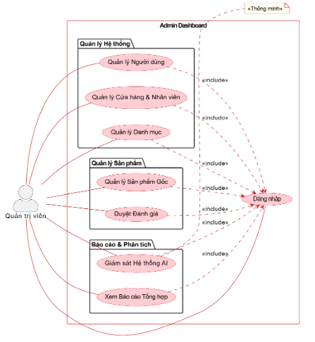

# LỜI CẢM ƠN {-}

Trên hành trình hoàn thành đề tài...

# GIỚI THIỆU ĐỀ TÀI

## Tên đề tài

Hệ thống gợi ý sản phẩm công nghệ

## Lý do chọn đề tài

Trong những năm trở lại đây...

{#fig:architecture width=80%}

Như thể hiện trong [@fig:architecture], hệ thống bao gồm...

: Bảng cấu trúc Role {#tbl:role}

| STT | Thuộc tính | Kiểu dữ liệu |
|:---:|:-----------|:------------:|
| 1   | id         | BIGINT       |
| 2   | name       | VARCHAR(50)  |

Cấu trúc bảng Role ([@tbl:role]) mô tả...

## Công thức

Hàm loss được định nghĩa:

$$
L = \sum (r_{ui} - u_u \cdot v_i^T)^2 + \lambda(||u_u||^2 + ||v_i||^2)
$$ {#eq:loss}

Từ phương trình [@eq:loss], ta có thể thấy...

# Snag sang sang 

sjfhsdklfjsadklfas fasdfsafasjfsalkfkasfsaf 

: Bảng cấu trúc cak {#tbl:cak}

| STT | Thuộc tính | Kiểu dữ liệu |
|:---:|:-----------|:------------:|
| 1   | id         | BIGINT       |
| 2   | name       | VARCHAR(50)  |
| 2   | cak       | VARCHAR(50)  |

Cấu trúc bảng Role ([@tbl:role]) mô tả...